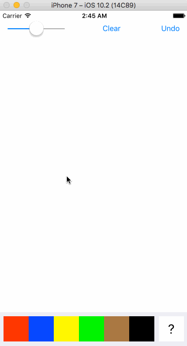

# Paintr
University Mobile App Dev Class - Lab 3

Submitted by: Ahmet Talha (Reis) Sirdas

## Extra Features (Creative Portion)

1) Created RGB sliders to make custom colors to draw lines with (click color button with question mark on it and sliders will pop up), custom color made with RGB sliders updates on color button. Whenever slider values change or custom color button is pressed, pen color is the custom color.

2) Made a draggable tray for color buttons and RGB sliders to make more space for canvas, tray uses animations and pan gesture recognizer (used code from https://guides.codepath.com/ios/Moving-and-Transforming-Views-with-Gestures and noted this at the top of ViewController)

## Video Walkthrough 

Here's a walkthrough:

GIF created with [LiceCap](http://www.cockos.com/licecap/).
